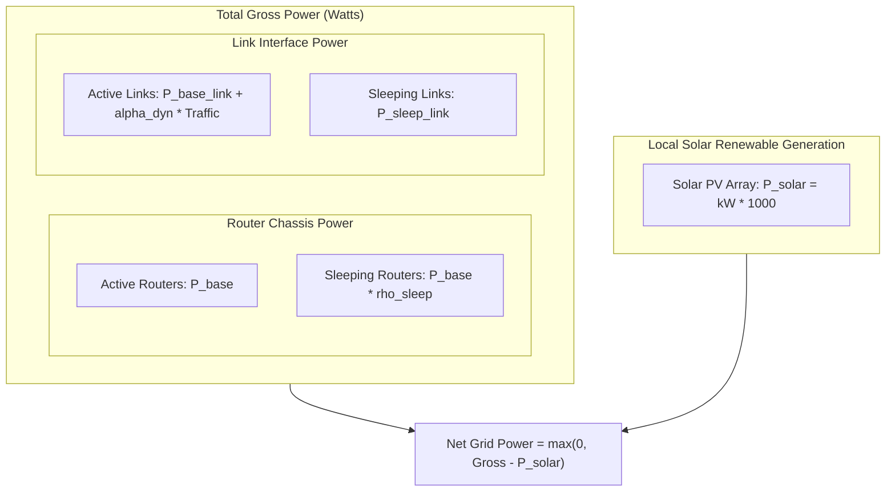
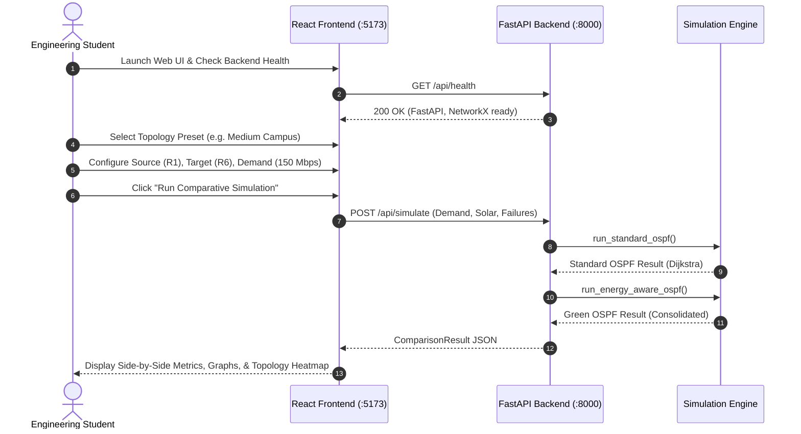

# Green OSPF Network Simulator — Academic Documentation & Laboratory Manual

**Course**: B.Tech Computer Science and Engineering / Information Technology  
**Subject**: Computer Networks / Green Computing / Advanced Computer Networks  
**Project Title**: Energy-Aware Modified Open Shortest Path First (Green OSPF) Network Simulator  
**Document Version**: 1.0.0 (Academic Reference Edition)  

---

## Important Academic Disclaimer

> [!IMPORTANT]
> **Academic Extension Notice**: The **Energy-Aware Modified OSPF** described in this document is an **academic research modification and simulation heuristic** developed for laboratory study, comparative benchmarking, and educational evaluation. It is **NOT** an industry-standard IETF RFC protocol (such as RFC 2328 or RFC 5340). Standard OSPF deployments in enterprise and carrier networks strictly utilize static link costs based on bandwidth and do not dynamically alter link power states or transition interfaces to sleep mode.

---

## 1. Problem Statement

Traditional Interior Gateway Protocols (IGPs), predominantly Open Shortest Path First (OSPF), compute forwarding paths based solely on static, performance-oriented metrics (primarily link bandwidth or propagation delay). In typical enterprise, data center, and campus network deployments, network infrastructure is provisioned for peak diurnal traffic volumes. Consequently, during off-peak windows (such as overnight hours or academic holidays), network links typically operate at a mere **10% to 30% utilization**.

Despite this low utilization:
1. Traditional network routers and switches keep all linecards, physical transceivers, and routing chassis fully powered in an active state.
2. An idle network interface or router chassis consumes approximately **80% to 90%** of its maximum rated operational power even when transmitting zero user packets.
3. Standard OSPF maintains equal-cost or shortest paths across all active links, dispersing traffic thinly across the entire topology and preventing unneeded links from powering down.

This architectural inflexibility results in substantial electrical waste, escalating operational expenditures (OpEx), and unnecessary carbon dioxide equivalent ($CO_2e$) emissions from non-renewable electrical grids. There is an urgent academic need to investigate **Energy-Aware Routing (EAR)** mechanisms that dynamically consolidate traffic flows onto a minimal, energy-efficient subset of active network links and routers during off-peak periods, allowing redundant infrastructure to transition into low-power sleep modes while strictly preserving Service Level Agreements (SLAs).

---

## 2. Project Objectives

1. **Benchmarking Foundation**: Construct a controlled, local simulation environment to model and evaluate standard OSPF routing dynamics alongside an academic Energy-Aware Modified OSPF heuristic.
2. **Traffic Consolidation & Sleep State Modeling**: Implement an energy model that quantifies chassis base power, linecard interface power, dynamic packet-forwarding power, and Low-Power Idle (LPI) sleep states.
3. **Multi-Objective Cost Formulation**: Design and analyze a composite routing metric balancing four competing parameters: standard OSPF path cost, energy footprint, link congestion avoidance, and power-state transition penalties.
4. **Renewable Energy Integration**: Incorporate on-site green energy sources (such as campus solar photovoltaic arrays) into the routing decision process to prioritize green-powered nodes over carbon-intensive grid-powered nodes.
5. **Quality of Service (QoS) Assurance**: Guarantee that energy-saving routing adaptations do not violate strict delay, hop count, and link utilization SLA thresholds.
6. **Educational Transparency**: Provide clear visualizations of Link-State Databases (LSDB), routing tables, link utilization heatmaps, and power consumption breakdowns for undergraduate pedagogy.

---

## 3. Project Scope

### In-Scope
- Modeling of three campus topology tiers:
  - **Small Campus**: 5 routers (Core, Distribution, Access tiers).
  - **Medium Campus**: 8 routers (Dual core, multi-aggregation, solar-equipped hubs, and edge data center).
  - **Large Campus**: 14 routers (Redundant rings, building distribution blocks, hostel pods, and border gateways).
- Dijkstra Shortest Path First (SPF) implementation for Standard OSPF based on standard reference bandwidth metrics ($100\text{ Gbps}$).
- Heuristic candidate path evaluation for Energy-Aware Modified OSPF factoring in energy consumption, solar offset, utilization, and sleep-to-active transition penalties.
- Quantitative comparison of:
  - Total gross power (Watts) and net grid power (Watts).
  - Average and peak link utilization (%).
  - End-to-end path delay (milliseconds) and hop count.
  - Number of active vs. sleeping routers and links.
- Interactive local web application (React, TypeScript, Vite) communicating via REST API with a decoupled FastAPI and NetworkX simulation backend.

### Out-of-Scope
- Direct hardware control via SNMP or NETCONF/YANG on physical Cisco/Juniper routing hardware.
- Real-time kernel packet injection (e.g., DPDK, eBPF, or Linux kernel IP forwarding).
- Inter-domain routing (BGP) or multi-area OSPF Level 1/Level 2 hierarchical border crossings (all topologies operate within a single backbone Area 0).
- Encrypted control-plane authentication (MD5/SHA-256 HMAC for OSPF packet exchanges).

---

## 4. Standard OSPF Explanation

Open Shortest Path First (OSPF) is a standardized, link-state Interior Gateway Protocol (IGP) specified in **RFC 2328** (OSPFv2 for IPv4) and **RFC 5340** (OSPFv3 for IPv6).

### 4.1 Link-State Advertisements (LSAs) & LSDB
Every OSPF router periodically broadcasts Link-State Advertisements (Type 1 Router-LSAs) to all neighboring routers within its area via reliable flooding over multicast addresses (`224.0.0.5` and `224.0.0.6`). Each Router-LSA enumerates the originating router's directly connected interfaces, neighbor router IDs, interface states, and configured metrics. 

By aggregating all received LSAs, every router in the area synthesizes an identical **Link-State Database (LSDB)**, representing a complete directed graph $G = (V, E)$ of the network topology.

### 4.2 Dijkstra Shortest Path First (SPF) Algorithm
Using its synchronized LSDB, each router independently executes Dijkstra's algorithm designating itself as the root node ($s$). The link metric in standard OSPF is calculated inversely proportional to the link capacity:

$$\text{Metric}(e) = \max\left(1, \; \left\lfloor \frac{\text{Reference Bandwidth}}{\text{Link Bandwidth}(e)} \right\rfloor \right)$$

For a path $P = (e_1, e_2, \dots, e_k)$ connecting source $s$ to destination $d$, the standard OSPF path cost is strictly additive:

$$C_{\text{OSPF}}(P) = \sum_{e \in P} \text{Metric}(e)$$

Dijkstra's algorithm selects the path $P^*$ that minimizes $C_{\text{OSPF}}(P)$:

$$P^* = \arg\min_{P \in \mathcal{P}_{s,d}} C_{\text{OSPF}}(P)$$

### 4.3 Operational Characteristics Under Off-Peak Load
Standard OSPF is completely oblivious to traffic demand magnitude and power consumption. Regardless of whether 1 Mbps or 10 Gbps is flowing:
- All interfaces maintain physical layer carrier detect signals and link pulses.
- Periodic OSPF `HELLO` packets (default interval: 10s) and dead timers (default interval: 40s) keep all links active.
- Transmit linecards and chassis fans run continuously at full baseline power.

---

## 5. Proposed Energy-Aware Modified OSPF Explanation

### 5.1 Nature of the Modification
The **Energy-Aware Modified OSPF** proposed herein is an **academic research extension**. It does not alter the fundamental link-state flooding mechanism of OSPF Area 0, but augments the path selection objective function and introduces dynamic interface power state management.

### 5.2 Algorithmic Philosophy: Traffic Consolidation
Rather than spreading traffic across all available paths, the Energy-Aware Modified OSPF identifies off-peak operational regimes and routes active traffic demands through a **consolidated backbone** of links and routers. 

```text
Off-Peak Traffic Demand (Low/Medium Load):
Standard OSPF:          Energy-Aware Modified OSPF:
  [R1] === (10G) === [R2]          [R1] === (Active) === [R2]
   ||                 ||            ||                     |
 (1G)               (1G)          (Sleep)               (Sleep)
   ||                 ||            ||                     |
  [R3] === (1G) ==== [R4]          [R3] ··· (Sleep) ···· [R4]
  (All 4 nodes & 4 links ON)       (R3, R4 & links put to SLEEP)
```

By intentionally funneling traffic through nodes already powered on (particularly nodes with renewable solar offsets), redundant parallel links and idle transit nodes are safely transitioned into a **Low-Power Sleep State** (`PowerState.SLEEP` / `LinkStatus.SLEEP`).

### 5.3 Multi-Criteria Candidate Path Evaluation
The proposed algorithm evaluates candidate loop-free paths between source $s$ and destination $d$ against a composite multi-factor cost metric:

$$C_{\text{composite}}(P) = \alpha \cdot \hat{C}_{\text{OSPF}}(P) + \beta \cdot \hat{E}(P) + \gamma \cdot \hat{U}(P) + \delta \cdot \hat{S}(P)$$

Subject to SLA admission bounds:
$$\text{Delay}(P) \le \text{SLA}_{\text{delay}}, \quad \text{Hops}(P) \le \text{SLA}_{\text{hops}}, \quad \max_{e \in P} \text{Util}(e) \le \text{SLA}_{\text{util}}$$

Where:
- $\hat{C}_{\text{OSPF}}(P)$: Normalized standard OSPF path cost (ensures throughput and high-capacity link prioritization).
- $\hat{E}(P)$: Normalized incremental power cost (rewards paths traversing routers with active solar generation and penalties for waking high-power chassis).
- $\hat{U}(P)$: Congestion penalty based on projected post-routing link utilization.
- $\hat{S}(P)$: Power-state penalty discouraging unnecessary awakening of sleeping interfaces.

---

## 6. Mathematical Formulas

### 6.1 Standard OSPF Metric Formula
Given a reference bandwidth $B_{\text{ref}} = 100,000 \text{ Mbps}$ ($100\text{ Gbps}$):

$$\text{Cost}(e) = \max\left(1, \; \left\lfloor \frac{B_{\text{ref}}}{B(e)} \right\rfloor \right)$$

*Example Values*:
- $40\text{ Gbps Link}$: $\text{Cost} = \lfloor 100,000 / 40,000 \rfloor = 2$
- $10\text{ Gbps Link}$: $\text{Cost} = \lfloor 100,000 / 10,000 \rfloor = 10$
- $1\text{ Gbps Link}$: $\text{Cost} = \lfloor 100,000 / 1,000 \rfloor = 100$

### 6.2 Composite Energy-Aware Cost Formula

$$C_{\text{composite}}(P) = \alpha \left(\frac{C_{\text{OSPF}}(P)}{C_{\max}}\right) + \beta \left(\frac{E_{\text{incremental}}(P)}{E_{\max}}\right) + \gamma \cdot \Phi_{\text{cong}}(P) + \delta \left(\frac{N_{\text{wake}}(P)}{|P|}\right)$$

Where the parameter weights satisfy:
$$\alpha + \beta + \gamma + \delta = 1.0 \quad (\alpha, \beta, \gamma, \delta \ge 0)$$

Default baseline weights configured in the simulator:
- $\alpha = 0.25$ (Performance weight)
- $\beta = 0.35$ (Energy minimization weight)
- $\gamma = 0.25$ (Congestion avoidance weight)
- $\delta = 0.15$ (State-transition stability weight)

### 6.3 Link Utilization Formula
For link $e$ with capacity $B(e)$ and current traffic $T(e)$ carrying an additional offered demand $\Delta T$:

$$U(e) = \frac{T(e) + \Delta T}{B(e)} \times 100\%$$

### 6.4 Delay Accumulation Formula
Assuming one-way link propagation delay $D_{\text{prop}}(e)$:

$$\text{Delay}_{\text{total}}(P) = \sum_{e \in P} D_{\text{prop}}(e)$$

---

## 7. Energy Model

The simulator models power consumption across three distinct tiers: router chassis, link interfaces, and local renewable energy offsets.



### 7.1 Router Chassis Power Model
For a router node $v \in V$:
- **Active State** ($v \in V_{\text{active}}$): Consumes baseline chassis power $P_{\text{base}}(v)$.
  - Core Router: $120\text{ W} - 160\text{ W}$
  - Distribution Router: $90\text{ W} - 110\text{ W}$
  - Access Router: $60\text{ W} - 70\text{ W}$
- **Sleep State** ($v \in V_{\text{sleep}}$): Consumes a reduced idle baseline power defined by the sleep power ratio $\rho_{\text{sleep}}(v) \in [0.10, 0.15]$:
  $$P_{\text{router}}(v) = P_{\text{base}}(v) \times \rho_{\text{sleep}}(v)$$

### 7.2 Link Interface Power Model
For a bidirectional link $e \in E$:
- **Active State** ($e \in E_{\text{active}}$): Consumes baseline linecard transceiver power $P_{\text{base\_link}}(e)$ plus dynamic traffic-dependent power:
  $$P_{\text{link}}(e) = P_{\text{base\_link}}(e) + \alpha_{\text{dyn}}(e) \cdot T(e)$$
  where $\alpha_{\text{dyn}}(e)$ is the dynamic power coefficient (typically $0.005$ to $0.012\text{ W/Mbps}$), and $T(e)$ is the traffic carried in Mbps.
- **Sleep State** ($e \in E_{\text{sleep}}$): Consumes Low-Power Idle (LPI) sleep power:
  $$P_{\text{link}}(e) = P_{\text{sleep\_link}}(e) \approx 0.10 \times P_{\text{base\_link}}(e)$$

### 7.3 Renewable Green Energy Offset
Routers equipped with on-site solar photovoltaic panels generate renewable power:

$$P_{\text{solar}}(v) = G_{\text{kW}}(v) \times 1000\text{ Watts}$$

### 7.4 Network-Wide Aggregate Power Equations
1. **Total Gross Power ($P_{\text{gross}}$)**:
   $$P_{\text{gross}} = \sum_{v \in V_{\text{active}}} P_{\text{base}}(v) + \sum_{v \in V_{\text{sleep}}} \left[ P_{\text{base}}(v) \cdot \rho_{\text{sleep}}(v) \right] + \sum_{e \in E_{\text{active}}} \left[ P_{\text{base\_link}}(e) + \alpha_{\text{dyn}}(e) T(e) \right] + \sum_{e \in E_{\text{sleep}}} P_{\text{sleep\_link}}(e)$$

2. **Net Grid Power ($P_{\text{net}}$)**:
   $$P_{\text{net}} = \max\left(0, \; P_{\text{gross}} - \sum_{v \in V} P_{\text{solar}}(v)\right)$$

3. **Percentage Power Saved ($\Delta P_{\%}$)**:
   $$\Delta P_{\%} = \left( \frac{P_{\text{gross}}^{\text{Standard}} - P_{\text{gross}}^{\text{Green}}}{P_{\text{gross}}^{\text{Standard}}} \right) \times 100\%$$

---

## 8. Congestion Model

To prevent aggressive energy consolidation from causing link saturation, packet buffer overflow, and excessive queuing delay, a strict congestion model is enforced.

### 8.1 Utilization Threshold
Each network link defines a maximum permissible utilization threshold:
$$U_{\max}(e) = 0.85 \quad (85\%)$$

Any routing decision that would cause the post-allocation link utilization $U(e)$ to exceed $85\%$ is flagged as congested.

### 8.2 Congestion Penalty Function $\Phi_{\text{cong}}(P)$
The congestion factor in the composite metric is computed as the maximum utilization across all links on candidate path $P$:

$$\Phi_{\text{cong}}(P) = \max_{e \in P} \left( \frac{T(e) + \Delta T}{B(e)} \right)$$

If $\Phi_{\text{cong}}(P) > 0.85$, the path is heavily penalized or disqualified during SLA filtering.

### 8.3 Queuing Delay Non-Linearity (Kleinrock / M/M/1 Model)
While propagation delay is static, real-world packet queuing delay escalates hyperbolically as utilization approaches link capacity:

$$D_{\text{queue}}(e) \approx \frac{1}{\mu C - \lambda} = \frac{D_{\text{tx}}(e)}{1 - U(e)}$$

By capping utilization at $85\%$, the simulator guarantees that the queuing delay multiplier remains bounded:

$$\frac{1}{1 - 0.85} \approx 6.67 \times D_{\text{tx}}$$

preventing buffer bloat and packet drops.

---

## 9. Constraints

The Energy-Aware Modified OSPF heuristic must strictly adhere to five operational constraints:

1. **Topology Connectivity Constraint**: The active subgraph $G_{\text{active}} = (V_{\text{active}}, E_{\text{active}})$ must remain weakly connected such that a valid path exists between every communicating source-destination pair.
2. **Delay SLA Constraint**:
   $$\text{Delay}_{\text{total}}(P) = \sum_{e \in P} \text{Delay}(e) \le \text{SLA}_{\text{max\_delay}} \quad (\text{default: } 30.0\text{ ms})$$
3. **Hop Count SLA Constraint**:
   $$\text{Hops}(P) = |P| - 1 \le \text{SLA}_{\text{max\_hop\_count}} \quad (\text{default: } 6\text{ hops})$$
4. **Link Capacity & Utilization Constraint**:
   $$\forall e \in P, \quad T(e) + \Delta T \le B(e) \times \text{SLA}_{\text{max\_utilization}} \quad (\text{default: } 85\%)$$
5. **Loop Freedom**: All computed paths must be strictly simple directed paths with no repeated nodes:
   $$\forall i \ne j, \quad v_i \ne v_j \in P$$

---

## 10. Assumptions

1. **Symmetric Bidirectional Links**: All links are modeled as symmetric bidirectional channels with identical bandwidth, delay, and base power in both directions.
2. **Synchronized Topology Information**: All routers possess an accurate, fully synchronized view of the network topology via link-state flooding.
3. **Instantaneous Transition Time**: For the purpose of the static flow simulation, interface power state transitions (active to sleep and vice versa) are treated as instantaneous, with transition latency accounted for via the $\delta$ penalty parameter.
4. **Constant Bit Rate (CBR) Flows**: Offered traffic demands are modeled as deterministic continuous flows in Mbps.
5. **Deterministic Solar Output**: Solar generation values reflect average daytime irradiance under clear-sky conditions.
6. **Area 0 Single Backbone**: All nodes reside in a single OSPF Area 0, eliminating inter-area summary LSA complexities.

---

## 11. Limitations

1. **Academic Heuristic vs. Distributed Protocol**: The Energy-Aware Modified OSPF is implemented as a centralized heuristic rather than a distributed consensus algorithm running autonomously on each router.
2. **Control Plane Sleep Signaling**: In real-world networks, putting an interface to sleep drops standard OSPF `HELLO` packets, which would normally trigger an adjacency teardown and network-wide LSA re-flooding (route flapping). Real-world implementation would require specialized extensions (e.g., IEEE 802.3az Energy Efficient Ethernet or Coordinated Sleep LSA extensions).
3. **Hardware Wake-Up Delay**: Physical router linecards require between $10\text{ ms}$ and $500\text{ ms}$ to warm up from deep sleep states. High-frequency traffic bursts could experience transient buffering or packet loss during wake-up.
4. **Static Traffic Snapshot**: The simulator evaluates single-demand or steady-state what-if scenarios rather than continuous dynamic stochastic packet arrivals.

---

## 12. System Architecture

The simulator utilizes a strictly decoupled, modern two-tier architecture:

```text
┌─────────────────────────────────────────────────────────────────┐
│               PRESENTATION LAYER (Frontend)                     │
│  React 19 • TypeScript • Vite • React Flow • Recharts • Tailwind │
│                                                                 │
│  - Interactive Topology Canvas (Drag, Zoom, Link States)        │
│  - Live Health & Latency Monitor (/api/health)                 │
│  - What-If Scenario Control Panel (Sliders, Solar, Seed)        │
│  - Comparative Performance Visualizations (Power, Delay, Hops)  │
└───────────────────────────────┬─────────────────────────────────┘
                                │ JSON HTTP REST Calls (Port 8000)
                                ▼
┌─────────────────────────────────────────────────────────────────┐
│                API & DISPATCH LAYER (Backend)                   │
│                    FastAPI • Pydantic V2                        │
│                                                                 │
│  - Request Validation & Schema Serialization                    │
│  - CORS Middleware for Localhost Security                       │
│  - Health Diagnostic Endpoints (/api/health, /health)          │
└───────────────────────────────┬─────────────────────────────────┘
                                │ Python Callables
                                ▼
┌─────────────────────────────────────────────────────────────────┐
│              CORE SIMULATION ENGINE (Simulation)                │
│                 NetworkX • Pure Python 3.11+                    │
│                                                                 │
│  - Campus Topology Presets (Small, Medium, Large)               │
│  - Standard OSPF Dijkstra SPF (RFC 2328 Reference Cost)         │
│  - Proposed Energy-Aware Heuristic (Multi-Factor Scoring)       │
│  - Power Consumption & Solar Offset Calculator                  │
│  - Link Utilization & SLA Constraint Validator                  │
└─────────────────────────────────────────────────────────────────┘
```

### 12.1 Presentation Layer (`frontend/`)
- Built with **React 19** and **TypeScript** for strict type safety.
- Employs **React Flow** (`@xyflow/react`) for interactive node-link graph visualization, rendering distinct visual states for active, sleeping, and failed links.
- Uses **Recharts** to plot real-time energy comparison bar charts and link utilization distributions.
- Styled using **Tailwind CSS** with a dark, high-contrast palette tailored for engineering laboratory environments.

### 12.2 API & Dispatch Layer (`backend/app/main.py`)
- Built on **FastAPI** to expose high-performance asynchronous REST endpoints.
- Validates all incoming simulation requests using **Pydantic V2** schemas.
- Completely isolated from frontend details, enabling headless testing and CLI execution.

### 12.3 Simulation Layer (`backend/app/simulation/`)
- Powered by **NetworkX** for graph data structures and path algorithms.
- `energy.py`: Houses the mathematical energy models for chassis, links, and solar offsets.
- `ospf.py`: Implements LSA generation, LSDB synthesis, Dijkstra SPF, and routing table calculation.
- `presets.py`: Stores verified topology definitions for Small, Medium, and Large campus scenarios.

---

## 13. Laboratory Experiment Procedure

This procedure guides students through a systematic comparative laboratory study of Standard OSPF vs. Energy-Aware Modified OSPF.



### Step-by-Step Instructions

#### Phase 1: Environment Verification
1. Open terminal 1 and start the FastAPI backend:
   ```bash
   cd backend
   .\venv\Scripts\Activate.ps1   # Windows
   uvicorn app.main:app --reload --host 127.0.0.1 --port 8000
   ```
2. Open terminal 2 and start the React frontend:
   ```bash
   cd frontend
   npm run dev
   ```
3. Open browser to `http://localhost:5173`.
4. Verify the top status badge displays **`Backend Connected`** with round-trip latency under $50\text{ ms}$.

#### Phase 2: Baseline Simulation (Small Campus)
1. Select the **Small Campus Network (5 Nodes)** preset.
2. Set **Source Router** to `R1` and **Target Router** to `R5`.
3. Set **Offered Traffic Demand** to `100 Mbps`.
4. Leave **Solar Available** enabled.
5. Click **Run Simulation**.
6. Record the resulting metrics for Standard OSPF and Energy-Aware OSPF into Observation Table 1.

#### Phase 3: Traffic Scaling & Congestion Stress Test (Medium Campus)
1. Switch to the **Medium Campus Network (8 Nodes)** preset.
2. Set **Source Router** to `R1` and **Target Router** to `R6`.
3. Conduct 4 runs by progressively varying the demand:
   - Run A: Low Load ($50\text{ Mbps}$)
   - Run B: Moderate Load ($150\text{ Mbps}$)
   - Run C: High Load ($400\text{ Mbps}$)
   - Run D: Peak Near-Capacity Load ($800\text{ Mbps}$)
4. Record gross power, net grid power, delay, hop count, and sleeping links in Observation Table 2.

#### Phase 4: What-If Link Failure & Resilience Analysis
1. In the **Medium Campus**, set demand to $150\text{ Mbps}$.
2. Inject a link failure by selecting `L_R1_R2` (10 Gbps primary backbone link) as **DOWN**.
3. Re-run the simulation.
4. Observe how Standard OSPF and Energy-Aware OSPF recalculate alternate paths (`R1 -> R4 -> R6` vs. `R1 -> R3 -> R6`).
5. Record path adaptation and power shift in Observation Table 3.

---

## 14. Observations Template

> [!NOTE]
> **Data Integrity Rule**: All numerical values entered into these observation templates must be directly transcribed from the running simulator dashboard. Do not fabricate or manually invent experimental values.

### Table 1: Baseline Comparison on Small Campus Topology (5 Nodes)
- **Source**: `R1` | **Destination**: `R5` | **Traffic Demand**: `100 Mbps` | **Solar**: Active

| Performance Metric | Standard OSPF | Energy-Aware Modified OSPF | Delta / Impact ($\Delta$) |
| :--- | :---: | :---: | :---: |
| **Selected Path** | *[Record Path]* | *[Record Path]* | *[Path Variation]* |
| **Total Hop Count** | *[e.g., 3]* | *[e.g., 3]* | *[Hops]* |
| **Path Delay (ms)** | *[Record ms]* | *[Record ms]* | *[Delta ms]* |
| **Active Routers Count** | *[Record]* | *[Record]* | *[Routers Saved]* |
| **Sleeping Routers Count** | 0 | *[Record]* | *[Sleep Count]* |
| **Active Links Count** | *[Record]* | *[Record]* | *[Links Saved]* |
| **Sleeping Links Count** | 0 | *[Record]* | *[Sleep Count]* |
| **Chassis Power (Watts)** | *[Record W]* | *[Record W]* | *[Delta W]* |
| **Link Power (Watts)** | *[Record W]* | *[Record W]* | *[Delta W]* |
| **Total Gross Power (Watts)** | *[Record W]* | *[Record W]* | *[Delta W]* |
| **Green Solar Offset (Watts)**| *[Record W]* | *[Record W]* | *[Offset W]* |
| **Net Grid Power (Watts)** | *[Record W]* | *[Record W]* | *[Net Delta W]* |
| **Energy Savings (%)** | 0.0% | *[Record %]* | *[% Savings]* |
| **Max Link Utilization (%)** | *[Record %]* | *[Record %]* | *[Delta %]* |

---

### Table 2: Traffic Load Variation on Medium Campus Topology (8 Nodes)
- **Source**: `R1` | **Destination**: `R6` | **Solar**: Active

| Run ID | Offered Demand (Mbps) | Standard OSPF Power (W) | Green OSPF Power (W) | Power Saved (%) | Standard Delay (ms) | Green Delay (ms) | Sleeping Links Count | Max Link Util (%) | SLA Met? (Yes/No) |
| :---: | :---: | :---: | :---: | :---: | :---: | :---: | :---: | :---: | :---: |
| **Run 1** | $50\text{ Mbps}$ | | | | | | | | |
| **Run 2** | $150\text{ Mbps}$ | | | | | | | | |
| **Run 3** | $400\text{ Mbps}$ | | | | | | | | |
| **Run 4** | $800\text{ Mbps}$ | | | | | | | | |

---

### Table 3: Link Failure What-If Scenario (Medium Campus, 150 Mbps Demand)
- **Simulated Link Failure**: `L_R1_R2` (Core Backbone Link DOWN)

| Parameter | Standard OSPF (Post-Failure) | Energy-Aware Modified OSPF (Post-Failure) | Analysis / Remarks |
| :--- | :--- | :--- | :--- |
| **Re-routed Path** | | | |
| **Path Feasibility** | *[Feasible / Infeasible]* | *[Feasible / Infeasible]* | |
| **End-to-End Delay (ms)** | | | |
| **Total Gross Power (W)** | | | |
| **Net Grid Power (W)** | | | |
| **Additional Sleeping Links** | | | |

---

## 15. Conclusion Template

*(Students must complete this section after recording observations from the simulator)*

### 15.1 Summary of Experimental Findings
1. **Energy Efficiency vs. Traffic Load**:
   - Under low traffic demands ($\le 150\text{ Mbps}$), the Energy-Aware Modified OSPF achieved a power reduction of **[Insert Recorded %]** compared to Standard OSPF.
   - Power savings were primarily achieved by placing **[Insert Number]** underutilized links and **[Insert Number]** transit routers into low-power sleep states.
2. **QoS and Delay Trade-Off**:
   - The average end-to-end delay under Green OSPF was **[Insert ms]** compared to **[Insert ms]** under Standard OSPF, representing an acceptable latency delta of **[Insert Delta ms]** within the configured SLA limit ($30\text{ ms}$).
3. **Renewable Energy Impact**:
   - The presence of solar-equipped routers (e.g., node `R4` in the Medium Campus) successfully biased the Green OSPF path selection toward green-powered paths, reducing net grid power draw to **[Insert Watts]**.
4. **Behavior Under Heavy Congestion**:
   - At peak loads ($800\text{ Mbps}$), the algorithm automatically **[woke up / avoided sleeping states on]** high-bandwidth links to satisfy the $85\%$ link utilization constraint, demonstrating robust congestion awareness.

### 15.2 Academic Trade-Off Analysis
| Optimization Objective | Standard OSPF Performance | Proposed Green OSPF Performance | Final Evaluation |
| :--- | :--- | :--- | :--- |
| **Power Minimization** | Poor (All devices 100% active) | Superior (Consolidation + Sleep) | Significant energy reduction during off-peak windows. |
| **Latency Minimization** | Optimal (Shortest metric path) | Near-Optimal (Sub-millisecond trade-off) | Trade-off remains safely within SLA bounds. |
| **Congestion Avoidance** | Static (Unaware of flow rate) | Dynamic (Threshold-bounded at 85%) | Prevents buffer exhaustion and packet drops. |

---

## 16. United Nations Sustainable Development Goals (SDG) Alignment

The Green OSPF Network Simulator directly aligns with the following **United Nations Sustainable Development Goals (SDGs)**:

```text
       ┌──────────────────────┐        ┌──────────────────────┐
       │     SDG TARGET 7.3   │        │     SDG TARGET 9.4   │
       │ Double Global Energy │        │ Upgrade & Retrofit   │
       │      Efficiency      │        │ ICT Infrastructure   │
       └──────────┬───────────┘        └──────────┬───────────┘
                  │                               │
                  ▼                               ▼
       ┌──────────────────────────────────────────────────────┐
       │      GREEN OSPF NETWORK SIMULATION PLATFORM          │
       │ - Dynamic Linecard Sleep State Modeling (LPI)        │
       │ - Traffic Consolidation during Off-Peak Hours        │
       │ - Renewable Solar PV Energy Routing Preferences      │
       └──────────────────┬───────────────────────┬───────────┘
                          │                       │
                          ▼                       ▼
       ┌──────────────────────┐        ┌──────────────────────┐
       │    SDG TARGET 12.2   │        │    SDG TARGET 13.2   │
       │ Sustainable Resource │        │ Climate Action & ICT │
       │     Management       │        │ Carbon Footprint Cut │
       └──────────────────────┘        └──────────────────────┘
```

### 1. SDG 7: Affordable and Clean Energy
- **Target 7.3**: *Double the global rate of improvement in energy efficiency by 2030.*  
  **Project Contribution**: Information and Communications Technology (ICT) and networking infrastructures account for over **$2\%$ to $3\%$ of global electricity demand**. By demonstrating dynamic traffic consolidation and linecard sleeping, this project quantifies direct electrical energy savings (Watts) in IP routing backbones.
- **Target 7.2**: *Increase substantially the share of renewable energy in the global energy mix.*  
  **Project Contribution**: The simulator integrates local green energy sources (solar arrays) directly into routing decisions, prioritizing routers running on on-site solar over fossil-fuel-powered utility grids.

### 2. SDG 9: Industry, Innovation, and Infrastructure
- **Target 9.4**: *Upgrade infrastructure and retrofit industries to make them sustainable, with increased resource-use efficiency and greater adoption of clean and environmentally sound technologies.*  
  **Project Contribution**: Provides network architects and students with an algorithmic framework to retrofit legacy IP routing protocols with power-awareness without requiring complete hardware replacement.

### 3. SDG 12: Responsible Consumption and Production
- **Target 12.2**: *Achieve the sustainable management and efficient use of natural resources.*  
  **Project Contribution**: Curtails the reckless over-provisioning and continuous full-power idling of electronic telecommunications equipment during off-peak hours.

### 4. SDG 13: Climate Action
- **Target 13.2**: *Integrate climate change measures into national policies, strategies, and planning.*  
  **Project Contribution**: Directly addresses Scope 2 greenhouse gas emissions by computing the exact reduction in kilowatt-hours (kWh) and associated carbon footprint reductions from power grid consumption.

---

## 17. Comprehensive Viva Voce Questions and Answers

### Section A: Fundamentals of OSPF and Link-State Routing

#### Q1: What is the fundamental difference between Link-State and Distance-Vector routing protocols?
**Answer**: Distance-vector protocols (e.g., RIP) operate on the principle of "routing by rumor," where routers exchange only their local routing tables with immediate neighbors periodically. In contrast, Link-State protocols (e.g., OSPF, IS-IS) flood Link-State Advertisements (LSAs) containing the status and cost of every local interface throughout the entire area. Consequently, every router constructs an identical map of the network (the Link-State Database, LSDB) and independently calculates loop-free shortest paths using Dijkstra's algorithm.

#### Q2: What is the purpose of the OSPF Hello protocol and how does it prevent neighbor adjacency drops?
**Answer**: The OSPF Hello protocol establishes and maintains neighbor adjacencies through periodic multicast messages (`224.0.0.5`). Routers must agree on configuration parameters (Hello Interval, Dead Interval, Area ID, Authentication, Subnet Mask, and Stub flags). If a router fails to receive a Hello packet within the configured Dead Interval (typically $4 \times \text{Hello Interval} = 40\text{ seconds}$), the neighbor is declared dead, triggering an LSA update to re-converge the network.

#### Q3: How is link cost traditionally calculated in Cisco OSPF implementations?
**Answer**: By default, Cisco OSPF calculates link cost using the formula:
$$\text{Cost} = \max\left(1, \; \left\lfloor \frac{\text{Reference Bandwidth}}{\text{Interface Bandwidth}} \right\rfloor \right)$$
Historically, the reference bandwidth defaulted to $100\text{ Mbps}$ ($10^8\text{ bps}$). In modern high-speed campus networks, this is adjusted to $100\text{ Gbps}$ ($100,000\text{ Mbps}$) so that 10 Gbps and 40 Gbps links do not share an identical cost of 1.

#### Q4: What are the primary types of OSPF LSAs?
**Answer**:
- **Type 1 (Router LSA)**: Generated by every router to describe its directly connected links within an area.
- **Type 2 (Network LSA)**: Generated by the Designated Router (DR) on multi-access broadcast networks.
- **Type 3 (Summary LSA)**: Originated by Area Border Routers (ABRs) to advertise inter-area routes.
- **Type 4 (ASBR Summary LSA)**: Advertises the location of an Autonomous System Boundary Router (ASBR).
- **Type 5 (AS-External LSA)**: Originated by ASBRs to redistribute external routes into the OSPF domain.

---

### Section B: Energy-Aware Routing & Green Networking

#### Q5: Is the "Energy-Aware Modified OSPF" implemented in this project an industry standard?
**Answer**: **No.** It is an **academic research modification and simulation heuristic** developed specifically for educational study and laboratory evaluation. Standard commercial OSPF implementations (RFC 2328) strictly follow static bandwidth metrics and do not dynamically alter link power states or transition interfaces to sleep mode.

#### Q6: Why do traditional enterprise routers consume substantial electrical power even when traffic is near zero?
**Answer**: Enterprise routing hardware is engineered for wire-speed performance with non-blocking switch fabrics. Components such as physical layer PHY chips, serializer/deserializers (SerDes), optical transceivers, Ternary Content-Addressable Memory (TCAM), and chassis cooling fans remain powered at full clock speeds and operating voltages continuously to maintain synchronization and guarantee instantaneous packet processing.

#### Q7: What is IEEE 802.3az Energy Efficient Ethernet (EEE) and how does it relate to link sleeping?
**Answer**: IEEE 802.3az is an Ethernet physical-layer standard that introduces a **Low-Power Idle (LPI)** mode. When no packets are waiting in the interface transmit queue, the PHY enters LPI mode, turning off transmitter circuitry while sending periodic refresh signals to keep the receiver synchronized. When packets arrive, the interface transitions back to active mode within microseconds. Our simulator models this behavior mathematically using `sleep_power_watts` and `PowerState.SLEEP`.

#### Q8: What is traffic consolidation in the context of Green Computing?
**Answer**: Traffic consolidation is the practice of routing active network flows through a minimal subset of well-utilized links and nodes during off-peak periods, rather than scattering flows evenly across the entire network. This intentional concentration frees up redundant parallel paths and aggregation routers, allowing them to enter low-power sleep states to save energy.

---

### Section C: Mathematical Models & Algorithmic Heuristics

#### Q9: Explain the components of the composite cost metric in the proposed algorithm:
$$C_{\text{composite}}(P) = \alpha \hat{C}_{\text{OSPF}}(P) + \beta \hat{E}(P) + \gamma \hat{U}(P) + \delta \hat{S}(P)$$
**Answer**:
1. **$\hat{C}_{\text{OSPF}}(P)$**: The normalized OSPF metric ensuring preference for high-bandwidth, high-capacity links.
2. **$\hat{E}(P)$**: The normalized incremental power consumption, factoring in chassis wattage, dynamic transmission energy, and rewarding paths with active on-site solar generation.
3. **$\hat{U}(P)$**: The congestion penalty based on the maximum link utilization along the path, preventing paths from operating close to the $85\%$ bottleneck threshold.
4. **$\hat{S}(P)$**: The state transition penalty, which discourages the algorithm from waking up a sleeping link if an existing active link can handle the flow within SLA bounds.

#### Q10: How does on-site solar renewable energy affect the routing decision?
**Answer**: When a router has on-site solar power available (`green_energy_kw > 0`), its local power offset reduces the net grid power draw:
$$P_{\text{net}} = \max(0, P_{\text{gross}} - P_{\text{solar}})$$
In the energy metric $\hat{E}(P)$, paths traversing solar-powered nodes incur lower effective grid power costs, making them algorithmically favorable compared to grid-reliant paths.

#### Q11: Why is link utilization capped at 85% rather than 100%?
**Answer**: According to queueing theory (M/M/1 queue model), as link utilization approaches $100\%$ ($U \to 1.0$), average queue lengths and packet waiting times grow asymptotically toward infinity ($\frac{1}{1 - U}$). Capping utilization at $85\%$ ensures that network buffers do not overflow, packet loss is averted, and queuing delays remain strictly bounded.

#### Q12: What is the computational time complexity of computing shortest paths using Dijkstra's algorithm?
**Answer**: Using a standard adjacency list and a min-priority queue implemented with a Fibonacci heap, Dijkstra's algorithm has a time complexity of:
$$\mathcal{O}(|E| + |V| \log |V|)$$
Where $|V|$ is the number of router nodes and $|E|$ is the number of links. In our simulator, the candidate path evaluation heuristic runs in polynomial time suitable for rapid interactive exploration.

---

### Section D: Practical Challenges & Real-World Deployments

#### Q13: If an interface transitions to sleep in a real OSPF network, what major issue occurs?
**Answer**: In standard OSPF, putting an interface to sleep stops the transmission of Hello packets. The neighboring router's Dead Timer expires, interpreting the sleep state as a physical link failure. This triggers the generation of new Type 1 LSAs, network-wide flooding, Dijkstra recalculation across all routers, and potential transient routing loops. To prevent this in real deployments, OSPF protocol extensions (e.g., "Coordinated Sleep LSA" or "Graceful Link Deactivation") would be required to notify neighbors that the link is sleeping intentionally.

#### Q14: What is route flapping and how does the $\delta$ parameter help prevent it?
**Answer**: Route flapping occurs when a route oscillates rapidly between active and inactive states due to marginal traffic variations, causing continuous protocol re-convergence and CPU exhaustion. The state penalty $\delta \left(\frac{N_{\text{wake}}}{|P|}\right)$ introduces hysteresis: a sleeping link will not be awakened for a negligible, temporary traffic increase unless the energy or performance benefit substantially outweighs the transition penalty.

#### Q15: How does the simulator decouple the frontend user interface from the backend simulation engine?
**Answer**: The backend simulation engine (`backend/app/simulation/`) is written in pure Python using NetworkX and Pydantic, with zero knowledge of HTTP or HTML. The FastAPI layer (`backend/app/main.py`) acts as a bridge, exposing RESTful JSON endpoints (`/api/health`, `/api/simulate`). The React frontend communicates strictly via HTTP requests, rendering the JSON response using React Flow and Recharts. This decoupling ensures the core simulation engine can be tested headlessly via pytest or run in CLI environments.

#### Q16: How does the simulator model link failures?
**Answer**: When a link is designated as failed (e.g., via the `failed_links` parameter in a what-if scenario), the graph builder removes the corresponding edge from the NetworkX graph $G$ prior to path computation. If no alternate path exists within SLA constraints, the simulator flags the demand as infeasible and reports a clear error message.

---

### Section E: Sustainable Development Goals & Societal Impact

#### Q17: Which UN Sustainable Development Goal is most directly impacted by this project?
**Answer**: **SDG 7 (Affordable and Clean Energy)**, specifically **Target 7.3** (doubling the global rate of improvement in energy efficiency). By demonstrating algorithmic traffic consolidation and interface sleep states, the project shows how telecommunication backbones can curtail electricity consumption during off-peak hours.

#### Q18: How does this project relate to SDG 13 (Climate Action)?
**Answer**: The electrical power consumed by data networks is largely drawn from national power grids that still rely on fossil fuel generation (coal and natural gas). Reducing network power consumption directly lowers the carbon intensity (grams of $CO_2$ emitted per gigabyte transmitted), contributing to global greenhouse gas mitigation under SDG Target 13.2.

#### Q19: What is the practical trade-off between energy conservation and end-to-end packet latency?
**Answer**: Energy-aware traffic consolidation intentionally detours flows away from dormant, direct high-speed paths to route them through active shared paths. This inherently increases the hop count and propagation delay slightly. However, as demonstrated in our simulator, as long as the total path delay remains well within the application's SLA budget (e.g., $< 30\text{ ms}$ for interactive multimedia or web traffic), this latency trade-off is an acceptable compromise for significant energy savings.

#### Q20: What future research directions could extend this academic simulator?
**Answer**:
1. Implementing machine learning (e.g., LSTM or Reinforcement Learning) to forecast diurnal traffic patterns and proactively schedule interface sleep/wake cycles.
2. Integrating Segment Routing (SRv6) or Software-Defined Networking (OpenFlow/P4) controllers to dynamically enforce energy-aware explicit paths.
3. Modeling battery storage systems alongside solar generation to store excess daytime green power for evening network operations.

---

## 18. References

1. Moy, J. (1998). *OSPF Version 2*. RFC 2328, Internet Engineering Task Force (IETF).
2. Coltun, R., Ferguson, D., Moy, J., & Lindem, A. (2008). *OSPF for IPv6*. RFC 5340, IETF.
3. IEEE Computer Society. (2010). *IEEE Standard 802.3az: Energy Efficient Ethernet*. IEEE Standards Association.
4. Chiaraviglio, L., Mellia, M., & Neri, F. (2009). *Reducing power consumption in backbone networks*. IEEE International Conference on Communications (ICC).
5. Bianzino, A. P., Chaudet, C., Rossi, D., & Rougier, J. L. (2012). *A survey of green networking research*. IEEE Communications Surveys & Tutorials, 14(1), 3-20.
6. United Nations. (2015). *Transforming our world: The 2030 Agenda for Sustainable Development*. UN Department of Economic and Social Affairs.
7. Cisco Systems. (2020). *OSPF Cost Calculation and Reference Bandwidth Guidelines*. Cisco Technical Documentation.
